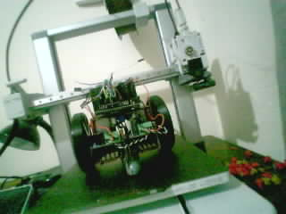
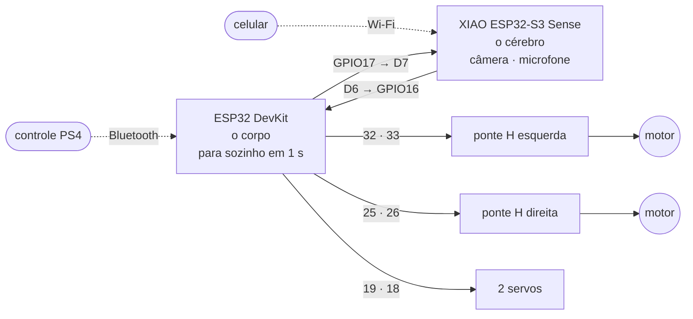

# Feijão com Farinha

Robô móvel que anda, ouve e vê — e que se dirige pelo controle de PS4 ou pelo
celular. Duas placas: uma que pensa e uma que anda.



> **Estado (05/10/2026):** o firmware roda nas duas placas. O robô fotografa,
> **transcreve fala**, tem página própria para dirigir, e **as rodas giram pelo
> controle de PS4**. **As duas placas ainda não foram ligadas entre si** — sem
> isso, o ✕ pede a foto e o cérebro não ouve. O caminho até aqui e o que falta:
> [`docs/00-resumo.md`](docs/00-resumo.md).

## Como é



O cérebro decide e manda comandos de texto pela serial (`M 40 40`, `STOP`). O
corpo obedece — e **para sozinho se o cérebro calar por 1 segundo**. O controle
de PS4 fala direto com o corpo, e enquanto alguém mexe nele, **ele tem a
prioridade**. `STOP` vale sempre, venha de quem vier.

**A câmera é a visão do [Jaspy](https://github.com/popliosemigod/Jaspy).** A
XIAO guarda as últimas 8 fotos e as entrega na rede do robô: `GET /foto.jpg`
(a mais recente), `GET /fotos` (a lista), `POST /foto` (tira agora). A página
do celular mostra as mesmas, só para uma olhada rápida. A foto acima saiu
assim.

## Pinagem

### Cérebro ↔ corpo — três fios

| XIAO S3 Sense | ESP32 DevKit |
| --- | --- |
| **D6** (TX) | **GPIO16** (RX2) |
| **D7** (RX) | **GPIO17** (TX2) |
| **GND** | **GND** |

Ligação direta e cruzada, 3,3 V dos dois lados, sem resistor.

### Corpo (ESP32 DevKit) → pontes H e servos

| ESP32 DevKit | Vai em |
| --- | --- |
| **GPIO32** | ponte **esquerda**, RPWM |
| **GPIO33** | ponte **esquerda**, LPWM |
| **GPIO25** | ponte **direita**, RPWM |
| **GPIO26** | ponte **direita**, LPWM |
| **GPIO27** | R_EN + L_EN **das duas** pontes, juntos — e **10 kΩ deste ponto ao GND** |
| **GPIO19** | servo 1, sinal |
| **GPIO18** | servo 2, sinal |
| **3V3** | VCC lógico das duas pontes |

As pontes ocupam **cinco pinos seguidos** de um lado da DevKit (32, 33, 25, 26,
27); servos e enlace ficam lado a lado do outro. Nenhum é pino de *strapping*.
Pontes BTS7960 (módulo IBT-2): motores nos bornes M+ / M−, bateria em B+ / B−.

A **câmera** e o **microfone** já estão na XIAO: nenhum fio. O amplificador,
quando chegar, vai em D0, D1 e D2 ([`docs/01`](docs/01-hardware-e-pinagem.md)).

### Alimentação

| O quê | De onde |
| --- | --- |
| Motores | bateria, no borne grosso das pontes |
| Lógica das pontes | **3,3 V** — não 5 V |
| Servos | regulador próprio de 5–6 V, **≥ 2 A** — nunca pela placa |
| XIAO (pino 5V) e DevKit (pino VIN) | **5 V** |
| **GND** | **o mesmo ponto para tudo** |

Um capacitor de 470–1000 µF perto das pontes e outro perto dos servos. Os
porquês em [`docs/02`](docs/02-ligacoes-e-alimentacao.md); a montagem passo a
passo em [`docs/06`](docs/06-montagem-do-corpo.md).

## Dirigir

**Pelo controle de PS4.** Uma vez, com o controle e a DevKit no USB do PC:

```powershell
python scripts/pareia_ps4.py --corpo COM4
```

Tire o cabo e aperte **PS**: a barra de luz fica verde quando o robô aceita.

| Controle | Faz |
| --- | --- |
| manche esquerdo | anda e vira |
| **○** | freia |
| **✕** | foto — aparece na página; com a XIAO no PC, `scripts/fotos.py` salva |
| **L2** / **R2** | servo 1 / servo 2, conforme o aperto; soltar volta a 90° |

**Pelo celular.** Entre na rede Wi-Fi **feijao-com-farinha** — a senha aparece
no console do cérebro no boot e no `?` — e abra **http://192.168.4.1**. Segurar
uma seta anda, soltar para; tocar na imagem tira uma foto, e a fileira embaixo
mostra as últimas (as do ✕ aparecem sozinhas). Se o telefone some, o robô para
em 0,4 s. Com `include/secrets.h` preenchido, o robô entra na rede de
casa no lugar de criar a própria.

**Pelo console**, com a XIAO no USB (`pio device monitor -p COM13`), teclas sem
Enter: `w` `a` `s` `d` `x` movem, `p` foto, `o` / `q` liga e desliga a escuta,
`?` estado. **O robô nunca anda sozinho ao ligar.**

## Gravar e usar

```powershell
pio run -e cerebro -t upload --upload-port COM13   # grava a XIAO
pio run -e corpo   -t upload --upload-port COM4    # grava a DevKit
python scripts/ouve.py --porta COM13               # fala para texto
python scripts/fotos.py --porta COM13              # salva as fotos do ✕ no PC
```

| Ambiente | Placa | |
| --- | --- | --- |
| **`cerebro`** | XIAO S3 Sense | câmera, microfone, página — **gravado** |
| **`corpo`** | ESP32 DevKit | motores, servos, failsafe, PS4 — **gravado** |
| `teste_som` | XIAO S3 Sense | teste simples: um som alto faz andar 1,5 s |
| `autoteste` | ESP32 DevKit | a lógica das duas placas, sem hardware |
| `bancada` | ESP32 DevKit | o corpo com log detalhado |
| `corpo_c3`, `cerebro_cam`, `teste_som_cam` | C3 e ESP32-CAM | as placas reserva |

## O que já funciona

| | Medido |
| --- | --- |
| Autoteste da lógica, na DevKit | 65 de 65, em 224 ms |
| Failsafe | para em **1001 ms** sem comando |
| Câmera da XIAO (OV3660) | brilho médio 118 de 255; guarda as últimas 8 fotos |
| **Fala para texto** | 5 de 5 frases, 2,5 a 3,6 s cada, sem nuvem |
| **Controle de PS4** | conecta, e **as rodas giram** com boa resposta |
| Foto pedida pelo PC | sai da XIAO e vira arquivo (`scripts/fotos.py`) |
| Rede própria do robô | no ar e visível; página de 2,2 KB |

## O que falta

- **Ligar os três fios** entre a XIAO e a DevKit: sem eles, a foto do ✕ não
  chega à câmera. Depois, dirigir pelo celular.
- **O texto virar ordem:** o que o robô ouve aparece na tela do PC e para ali.
- A **antena** da XIAO: sem ela, a rede do robô alcança poucos metros.
- Servos, alto-falante, e voz de gente com o motor ligado.

## Documentação

| | |
| --- | --- |
| **[00](docs/00-resumo.md)** | **resumo: o caminho até aqui, como está, o que falta** |
| [01](docs/01-hardware-e-pinagem.md) | as placas, a pinagem completa, e por que são duas |
| [02](docs/02-ligacoes-e-alimentacao.md) | alimentação, GND, capacitores, o BTS7960 em 3,3 V |
| [03](docs/03-protocolo-uart.md) | o protocolo, o failsafe, quem tem a vez, o console pelo enlace |
| [04](docs/04-roteiro-de-bancada.md) | roteiro de ensaios, com as previsões escritas antes |
| [05](docs/05-a-voz.md) | a voz: o que já ouve, e o que falta decidir |
| [06](docs/06-montagem-do-corpo.md) | montagem passo a passo |
| [07](docs/07-reconhecimento-de-objetos.md) | reconhecimento de objetos |
| [diário](diario.md) | cada sessão: previsto, medido, e o que deu errado |

## Notas

**Windows.** Rode o `pio` pelo PowerShell (o instalador dos toolchains recusa o
Git Bash) e, se a instalação falhar com `FileNotFoundError` num caminho enorme,
encurte o cache: `$env:PLATFORMIO_CACHE_DIR = "C:\Users\<voce>\.pc"`. Se o
Windows bloquear o `esptool.exe` (`Error 4551`), o projeto já contorna sozinho:
[`scripts/esptool_windows.py`](scripts/esptool_windows.py).

**Placas reserva.** O corpo já foi um ESP32-C3 SuperMini, e o cérebro uma
ESP32-CAM; o firmware continua compilando para os dois. O C3 não tem Bluetooth
clássico, então sem controle de PS4; a CAM precisa de microfone externo e de um
adaptador USB que ocupa o header inteiro. Detalhes em
[`docs/01`](docs/01-hardware-e-pinagem.md).

## Crédito

Projeto do laboratório [Jaspy](https://github.com/popliosemigod/Jaspy). O
desenho do corpo — limites como único caminho até o hardware, e o firmware que
compila sem `secrets.h` — vem do `firmware/jaspy-corpo` daquele repositório.
O controle de PS4 usa a biblioteca
[PS4Controller](https://github.com/pablomarquez76/PS4_Controller_Host), de Juan
Pablo Marquez.
