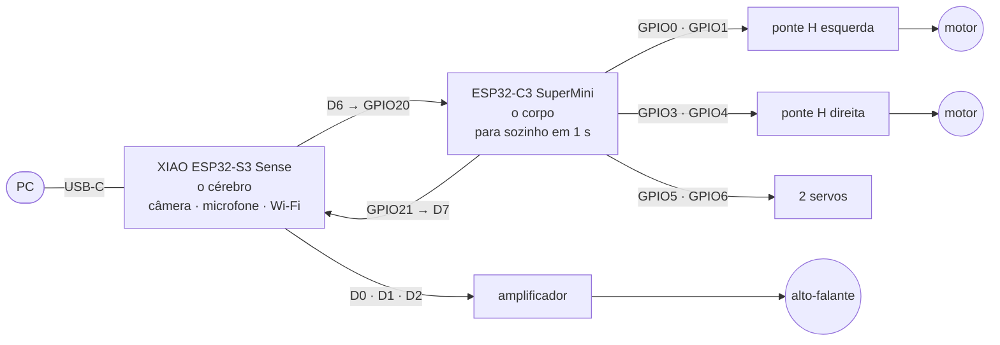

# Feijão com Farinha

Robô móvel que anda, ouve e vê. Duas placas: uma que pensa e uma que anda.

> **Estado (01/10/2026):** o firmware roda nas duas placas. A câmera fotografa, o
> robô **transcreve fala**, e o failsafe foi medido.
> **Nenhum motor foi visto girando, e as duas placas atuais ainda não conversaram.**
> O caminho até aqui e o que falta: [`docs/00-resumo.md`](docs/00-resumo.md).

## Como é



O cérebro decide e manda comandos de texto pela serial (`M 40 40`, `STOP`). O
corpo obedece — e **para sozinho se o cérebro calar por 1 segundo**. O pior caso
de qualquer defeito no cérebro é o robô parar, nunca sair andando.

## Pinagem

### Cérebro ↔ corpo — três fios

| XIAO S3 Sense | ESP32-C3 |
| --- | --- |
| **D6** (GPIO43, TX) | **GPIO20** (RX) |
| **D7** (GPIO44, RX) | **GPIO21** (TX) |
| **GND** | **GND** |

Ligação direta e cruzada, 3,3 V dos dois lados, sem resistor.

### Corpo (ESP32-C3) → pontes H e servos

| ESP32-C3 | Vai em |
| --- | --- |
| **GPIO0** | ponte **esquerda**, RPWM |
| **GPIO1** | ponte **esquerda**, LPWM |
| **GPIO3** | ponte **direita**, RPWM |
| **GPIO4** | ponte **direita**, LPWM |
| **GPIO10** | R_EN + L_EN **das duas** pontes, juntos — e **10 kΩ deste ponto ao GND** |
| **GPIO5** | servo 1, sinal |
| **GPIO6** | servo 2, sinal |
| **3,3 V** | VCC lógico das duas pontes |

Pontes BTS7960 (módulo IBT-2). Os motores vão nos bornes M+ / M− de cada ponte,
e a bateria nos bornes B+ / B−.

### Cérebro (XIAO) → amplificador

| XIAO S3 Sense | MAX98357A |
| --- | --- |
| **D0** (GPIO1) | BCLK |
| **D1** (GPIO2) | LRC |
| **D2** (GPIO3) | DIN |
| **5 V** | VIN |

A **câmera** e o **microfone** já estão na placa Sense: nenhum fio.
Livres na XIAO: D3, D4, D5.

### Alimentação

| O quê | De onde |
| --- | --- |
| Motores | bateria, no borne grosso das pontes |
| Lógica das pontes | **3,3 V** — não 5 V |
| Servos | regulador próprio de 5–6 V, **≥ 2 A** — nunca pela placa |
| XIAO e amplificador | **5 V** |
| **GND** | **o mesmo ponto para tudo** |

Um capacitor de 470–1000 µF perto das pontes e outro perto dos servos. Os
porquês de cada linha estão em
[`docs/02`](docs/02-ligacoes-e-alimentacao.md); a montagem passo a passo, com um
teste ao fim de cada etapa, em [`docs/06`](docs/06-montagem-do-corpo.md).

## Usar

```powershell
pio run -e cerebro -t upload --upload-port COM13   # grava a XIAO
pio run -e corpo   -t upload --upload-port COM7    # grava o C3
pio device monitor -p COM13                        # console do cérebro
python scripts/ouve.py --porta COM13               # fala para texto
```

No console do cérebro, as teclas valem sem Enter:

| Tecla | |
| --- | --- |
| `w` `a` `s` `d` `x` | frente, esquerda, ré, direita, parar |
| `1` `2` | servo 1, servo 2 |
| `p` | tira uma foto e despeja em base64 |
| `o` / `q` | liga / desliga a escuta de frases |
| `t` | rotina de teste: anda, para, gira, mexe os servos |
| `?` | estado de tudo |

O corpo também aceita comando direto, pelo USB dele: `M 40 40` anda a 40 % — e o
failsafe para em 1 s. O protocolo inteiro está em
[`docs/03`](docs/03-protocolo-uart.md).

**O robô nunca anda sozinho ao ligar.** Só por tecla.

| Ambiente | Placa | |
| --- | --- | --- |
| **`cerebro`** | XIAO S3 Sense | o cérebro — **o que está gravado** |
| **`corpo`** | ESP32-C3 | motores, servos, failsafe — **o que está gravado** |
| `teste_som` | XIAO S3 Sense | teste simples: um som alto faz andar 1,5 s |
| `autoteste` | ESP32-C3 | a lógica das duas placas, sem hardware |
| `cerebro_cam`, `teste_som_cam` | ESP32-CAM | os mesmos, na placa reserva |
| `bancada` | ESP32-C3 | o corpo com log detalhado |

## O que já funciona

| | Medido |
| --- | --- |
| Autoteste da lógica, no C3 | 56 de 56 |
| Failsafe | para em **1001 ms** sem comando |
| Câmera da XIAO | foto de 320×240; sensor OV3660 |
| Microfone da XIAO | silêncio 0,001 · voz 0,01 a 0,055 |
| **Fala para texto** | 5 de 5 frases, 2,5 a 3,6 s cada, sem nuvem |
| Gravar a ESP32-CAM pela serial | 354 KB em 43 s, sem adaptador |

| Primeira foto do projeto — ESP32-CAM, 29/09 | Primeira foto da XIAO — 01/10, sala à noite |
| --- | --- |
|  |  |

As duas saíram em base64 pelo console (`p`). A da XIAO é escura porque a sala
estava escura: o ganho já está no teto, e com pouca luz esta câmera não vai além.

## O que falta

- **Ver um motor girar.** O corpo recebe o comando; ninguém confirmou a roda.
- **Ligar a XIAO ao C3** — os três fios da tabela acima.
- **O texto virar ordem:** o que o robô ouve aparece na tela do PC e para ali.
- Servos, alto-falante, Wi-Fi (console por rede, foto pelo celular).
- Voz de gente, e com o motor ligado: a transcrição só foi medida com voz
  sintética, numa sala em silêncio.

## Documentação

| | |
| --- | --- |
| **[00](docs/00-resumo.md)** | **resumo: o caminho até aqui, como está, o que falta** |
| [01](docs/01-hardware-e-pinagem.md) | as placas, a pinagem completa, e por que são duas |
| [02](docs/02-ligacoes-e-alimentacao.md) | alimentação, GND, capacitores, o BTS7960 em 3,3 V |
| [03](docs/03-protocolo-uart.md) | o protocolo, o failsafe, o console e a gravação pelo enlace |
| [04](docs/04-roteiro-de-bancada.md) | roteiro de ensaios, com as previsões escritas antes |
| [05](docs/05-a-voz.md) | a voz: o que já ouve, e o que falta decidir |
| [06](docs/06-montagem-do-corpo.md) | montagem passo a passo |
| [07](docs/07-reconhecimento-de-objetos.md) | reconhecimento de objetos e foto pelo celular |
| [diário](diario.md) | cada sessão: previsto, medido, e o que deu errado |

## Notas

**Windows.** Rode o `pio` pelo PowerShell (o instalador dos toolchains recusa o
Git Bash) e, se a instalação falhar com `FileNotFoundError` num caminho enorme,
encurte o cache: `$env:PLATFORMIO_CACHE_DIR = "C:\Users\<voce>\.pc"`. É o limite
de 260 caracteres do Windows; no Linux e no CI não acontece.

**ESP32-CAM, a placa reserva.** Foi o cérebro enquanto a XIAO estava em outro
projeto, e o firmware continua compilando para ela. Custa um microfone externo
(INMP441), um resistor de 10 kΩ no GPIO12 e um adaptador USB que ocupa o header
inteiro — por isso nela o console e a gravação passam pelo USB do corpo. Pinagem
e ressalvas em [`docs/01`](docs/01-hardware-e-pinagem.md#a-esp32-cam-como-cérebro--o-plano-b).

**Wi-Fi.** Preencha `include/secrets.h` (copie de `secrets.example.h`) e o robô
sobe com console em `telnet <ip> 23` e uma página de foto em `http://<ip>/`.
Escrito e compilando; ainda não rodou numa placa.

## Crédito

Projeto do laboratório [Jaspy](https://github.com/popliosemigod/Jaspy). O
desenho do corpo — limites como único caminho até o hardware, e o firmware que
compila sem `secrets.h` — vem do `firmware/jaspy-corpo` daquele repositório.
