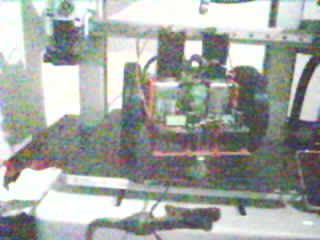

# Feijão com Farinha

Robô móvel com voz, escuta, câmera e movimento. Duas placas: uma que pensa e
uma que anda.

> **Estado:** firmware compilando, e as duas placas já ligadas na bancada.
> O autoteste rodou no ESP32-C3 (**56 de 56**), e a câmera da ESP32-CAM
> capturou um quadro real.
> **Nenhum motor foi ligado, nenhum servo girou, e o robô ainda não existe
> montado.**

## Objetivo

Um robô que se move pela sala, ouve quem fala com ele e responde — e que é o
mesmo agente que já mora no laboratório [Jaspy](https://github.com/popliosemigod/Jaspy),
só que com rodas.

1. **Mover com segurança**, num robô que nunca sai andando sozinho quando algo
   trava.
2. **Ouvir e falar**, com o reconhecimento rodando fora da placa.
3. **Ver**, com a câmera da própria placa.
4. **Ser o mesmo personagem** que o avatar em AR — um agente, vários corpos.

## Arquitetura

```
   XIAO ESP32-S3 Sense                ESP32-C3 SuperMini
   o CEREBRO                          o CORPO
   camera, mic PDM, MAX98357A         2x BTS7960 (motores)
   Wi-Fi, PSRAM 8 MB, decisao  ──UART──►  2 servos
   heartbeat a cada 250 ms     ◄──────    failsafe: para com 1 s de silencio
                                OK/ERR/PONG
```

**O corpo não usa Wi-Fi, e isso é a metade que protege.** O pior caso de
qualquer defeito no cérebro — travar numa rede ruim, ficar sem memória
decodificando um quadro — é o robô **parar**, nunca sair andando sem comando.

Quem para o robô é o corpo, contando o tempo desde o último comando de
movimento. Nenhum dos dois lados precisa que o outro esteja correto para se
comportar bem.

## As placas já estão gravadas

`corpo` no ESP32-C3 e `cerebro_cam` na ESP32-CAM, com o firmware desta versão.
**Depois da montagem não há nada de software a fazer** — ligou, funciona. O
passo a passo, com um teste ao fim de cada etapa, está em
[`docs/06-montagem-do-corpo.md`](docs/06-montagem-do-corpo.md).

Dois resistores de 10 kΩ não são opcionais: um no **EN das pontes** e outro no
**GPIO12 da ESP32-CAM**. O segundo decide se a placa liga ou não.

## Compilar e gravar

```powershell
pio run                          # as duas placas e o autoteste

pio run -e corpo   -t upload     # a C3       (sempre com -e)
pio run -e cerebro -t upload     # a XIAO S3
pio device monitor -b 115200     # console
```

| Ambiente | Placa | |
| --- | --- | --- |
| `corpo` | ESP32-C3 SuperMini | motores, servos, UART, failsafe |
| **`cerebro_cam`** | **ESP32-CAM (AI-Thinker)** | **o cérebro que roda hoje** |
| `cerebro` | XIAO ESP32-S3 Sense | o mesmo cérebro, na placa melhor |
| `bancada` | ESP32-C3 SuperMini | o corpo com log detalhado |
| `autoteste` | qualquer ESP32 | a lógica das duas, sem hardware |

### Por que há dois cérebros

Há **uma única XIAO ESP32-S3 Sense** no laboratório, e três projetos a querem.
A ESP32-CAM é o que destrava este aqui enquanto isso.

É a mesma `main_cerebro.cpp` nas duas: muda só a pinagem, escolhida pelo flag
`-DCEREBRO_CAM`. Voltar para a Sense é tirar o flag.

O que a ESP32-CAM custa está em
[`include/config_cerebro_cam.h`](include/config_cerebro_cam.h), na seção *"O QUE
ESTA PLACA NÃO FAZ"*. A perda que muda o projeto: **ESP32 clássico não roda
ESP-SR**, então não existe a palavra *"para"* reconhecida sem rede.

E ela só coube porque este projeto **não usa cartão SD**: os seis GPIOs do SDMMC
são exatamente os que sobraram para a UART e para o microfone.

### Antes da primeira compilação, no Windows

O projeto usa o **Arduino core 3.x** (a API de PWM é `ledcAttach(pino, freq,
bits)`, que só existe do 3.0 em diante). A plataforma oficial do PlatformIO
parou no core 2.0.17, então o core 3.x vem do fork **pioarduino**, já declarado
no `platformio.ini`.

O pacote dele tem arquivos com caminho muito longo, e o Windows corta em 260
caracteres. Sem tratar isso, a instalação falha com uma mensagem que **não** diz
o que aconteceu: *"Failed to install Python dependencies"*, e embaixo um
`FileNotFoundError` num header de nome enorme.

Duas saídas, qualquer uma resolve:

```powershell
# 1. encurtar o diretorio do PlatformIO (nao precisa de administrador)
$env:PLATFORMIO_CORE_DIR = "C:\pio"
pio run

# 2. ou ligar caminhos longos no Windows, uma vez, COMO ADMINISTRADOR
Set-ItemProperty "HKLM:\SYSTEM\CurrentControlSet\Control\FileSystem" `
                 -Name LongPathsEnabled -Value 1
```

No Linux e no CI o problema não existe.

## A primeira foto desta câmera



Saiu **em base64 pela serial de gravação**, porque esta placa não tem cartão SD —
e não tem porque os seis pinos do cartão são exatamente os que a UART e o
microfone ocupam. O caminho todo está em
[`docs/06-montagem-do-corpo.md`](docs/06-montagem-do-corpo.md#a-primeira-foto-desta-câmera).

## Documentação

| | |
| --- | --- |
| **[06](docs/06-montagem-do-corpo.md)** | **montagem passo a passo — comece por aqui na bancada** |
| [01](docs/01-hardware-e-pinagem.md) | as duas placas, pinagem e por que são duas |
| [02](docs/02-ligacoes-e-alimentacao.md) | **alimentação, GND, capacitores e o BTS7960 em 3,3 V** |
| [03](docs/03-protocolo-uart.md) | o protocolo, o failsafe e quatro propostas em aberto |
| [04](docs/04-roteiro-de-bancada.md) | **roteiro de ensaios**, com as previsões escritas antes |
| [05](docs/05-a-voz.md) | a escolha do serviço de voz — ainda não tomada |

## Em aberto

1. **Qual serviço de voz** ([05-a-voz.md](docs/05-a-voz.md)). A recomendação é
   a ponte do Jaspy na LAN, com ESP-SR local só para a palavra *"para"*.
2. **Ligar a rampa de aceleração?** Está escrita e desligada
   ([03](docs/03-protocolo-uart.md#1-rampa-de-aceleração--recomendo-ligar)).
3. **Acrescentar `STATUS` ao protocolo?** Barato e útil.
4. Checksum e ID de sequência: **não** recomendados agora, e a razão está
   escrita.

## Medido na bancada

| | Previsto | Medido |
| --- | --- | --- |
| Autoteste no ESP32-C3 (ensaio 0) | 50 passam | **56 de 56, em 4 ms** |
| Failsafe dispara (ensaio 1) | 1000–1010 ms | **1001 ms** |
| `M 200 0` | recusa sem mover | **`ERR fora-de-faixa`** |
| `S 1 45` alimenta o relógio? | **não** | **não** — failsafe 1001 ms depois |
| Primeira foto da OV2640 | — | **11 860 bytes**, 320×240 |
| PSRAM livre na ESP32-CAM | 4063 KB de 4096 KB |
| Heap livre, com câmera e I2S de pé | 240 KB |
| Heartbeat com o corpo ausente | 46 enviados, 0 respostas — e o log acusa |

## O que não está provado

- **Nenhum motor girou e nenhum servo se mexeu.** Nada de potência foi ligado.
- **O INMP441 ainda não está ligado.** O I2S de entrada roda e entrega blocos, o
  nível medido é zero porque não há microfone nos pinos.
- **As duas placas nunca conversaram.** Falta o cabo da UART entre elas — o
  cérebro diz `corpo MUDO`, que é o comportamento certo.
- Os limites de ângulo dos servos são **de projeto**, não medidos com o
  mecanismo montado.
- O duty mínimo de partida dos motores não existe até o [ensaio
  4](docs/04-roteiro-de-bancada.md#ensaio-4--o-robô-no-chão-pela-primeira-vez).

## Crédito

Projeto do laboratório [Jaspy](https://github.com/popliosemigod/Jaspy). O
desenho do corpo — limites como único caminho até o hardware, parada que para
onde está, e o firmware que precisa compilar sem `secrets.h` — vem do
`firmware/jaspy-corpo` daquele repositório.
